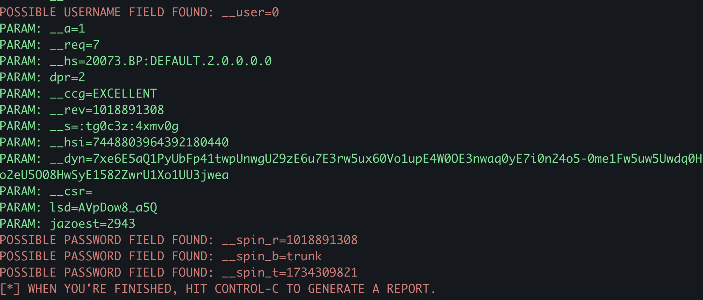

# Phishing para captura de senhas do Facebook do Bootcamp Santander Cybersecurity

### Ferramentas

- Macbook Pro M1
- setoolkit

### Configurando o Phishing

- Instalação do setoolkit: [setoolkit](https://github.com/trustedsec/social-engineer-toolkit)
- Iniciando o setoolkit: ``` setoolkit ```
- Tipo de ataque: ``` Social-Engineering Attacks ```
- Vetor de ataque: ``` Web Site Attack Vectors ```
- Método de ataque: ```Credential Harvester Attack Method```
- Método de ataque: ``` Site Cloner ```
- Obtendo o endereço da máquina: ``` ifconfig ```
- URL para clone: <http://facebook.com>

### Resutados



O facebook atualmente utiliza medidas para previnir esse tipo de ataque, como podemos ver na imagem.
